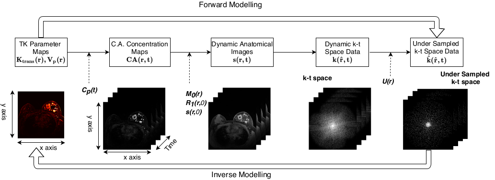
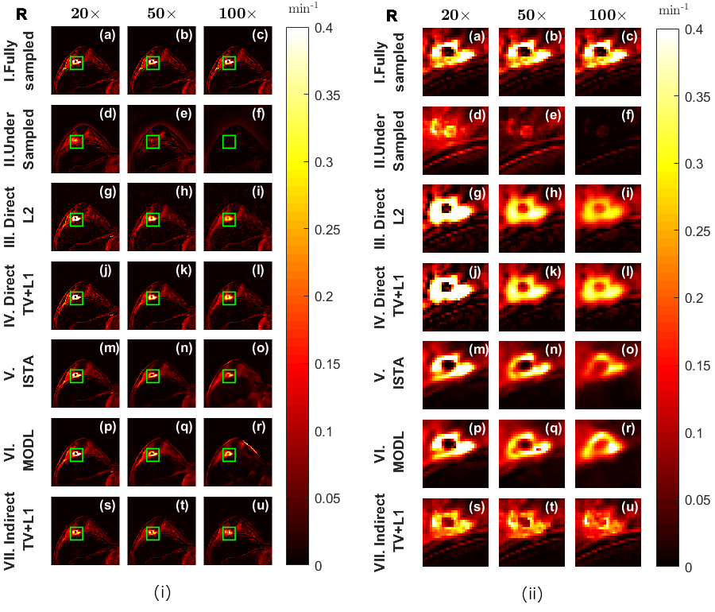
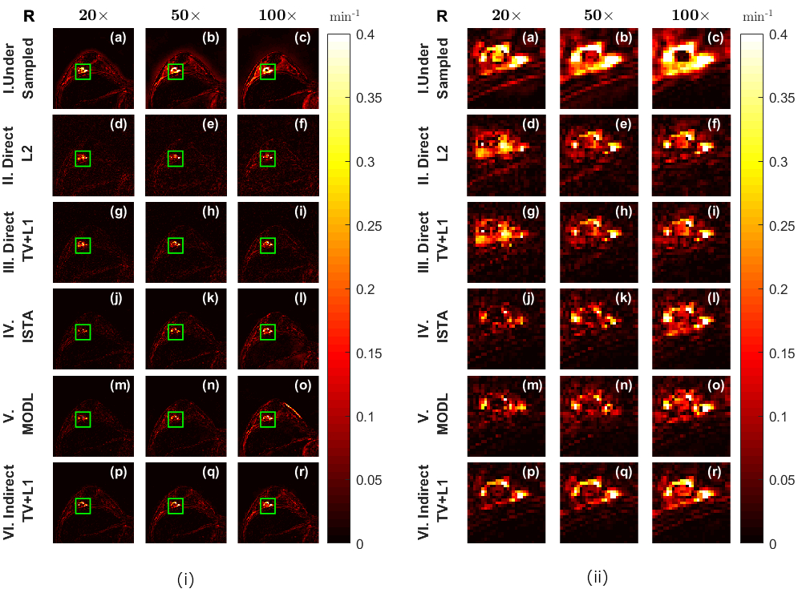

# Comparison of iterative parametric and indirect deep learning based reconstruction methods in highly

Our work focuses on estimating the permeability parameters from highly undersampled Dynamic Contrast-Enhanced (DCE) MR images. In this investigation, we systematically compare the performance of iterative direct and indirect parametric reconstruction methods with indirect deep learning-based reconstruction methods in estimating tracer-kinetic parameters from highly undersampled DCE-MR Imaging breast data. Our investigations conclude that the deep learning-based indirect techniques perform at par with direct estimation techniques for lower undersampling rates in the breast DCE-MR imaging. However, at higher undersampling rates, they are not able to provide much needed generalization. Direct estimation techniques are able to provide more accurate results than both deep learning and parametric-based indirect methods in these high undersampling scenarios. 

This article is accepted for publication in **Medical Physics** journal 

<b>Aditya Rastogi and Phaneendra K. Yalavarthy, “Comparison of iterative parametric and indirect deep learning-based reconstruction methods in highly undersampled DCE‐MR Imaging of the breast," Medical Physics, (2020), [https://doi.org/10.1002/mp.14447](https://aapm.onlinelibrary.wiley.com/doi/abs/10.1002/mp.14447)</b>

## Inverse Model

The forward and inverse modelling of Tracer Kinetic parameter estimation problem is shown below:

   

## Results

We estimated the Ktrans Maps from 20X, 50X and 100X undersampled DCE-MRI data using golden radial angle undersampling pattern. The result for **PAT B** for all reconstruction methods methods mentioned above is shown below:

   

The difference images are shown below:

   

