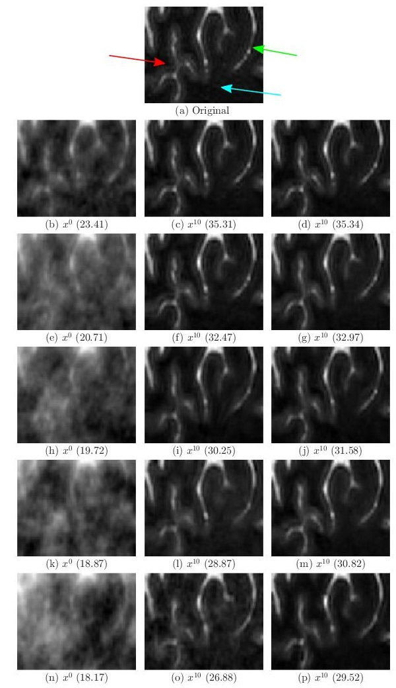

# SpiNet

The fast-MRI reconstruction problem is known to be ill-posed and therefore iterative reconstruction techniques with prior regularization are the method of choice. However, these techniques are computationally inefficient and requires manual tuning of regularization parameter and proper selection of prior. Recently, data driven methods based on deep learning (DL) have been able to provide promising results with few questions to be addressed like data dependency, lack of interpretability and lack of uncertainty quantification. We proposed a generic physics and deep learning-based MR image reconstruction model (named SpiNet) that can enforce any Schatten p-norm regularization with 0 < p ≤ 2, where the p can be learnt (or fixed) based on the problem at hand. Both the prior and the regularization parameter are learnt from the data. This network is more interpretable, stable to data perturbations and requires less data to train. Our experiments indicated that the proposed SpiNet shows higher PSNR and SSIM and lower NRMSE than other state-of-the-art methods physics based methods. We validated the performance of SpiNet for various undersampling rates, undersampling masks and on different body organs. For higher undersampling rates greater than 6×, SpiNet significantly outperforms current state-of-the-art method in all metrices with improvement as high as 4 dB in PSNR and 0.05 points in SSIM.  

### This paper is published in **Medical Physics** journal. 

Rastogi A, Yalavarthy PK. SpiNet: A deep neural network for Schatten p-norm regularized medical image reconstruction. Med Phys. 2021 May;48(5):2214-2229. doi: 10.1002/mp.14744. Epub 2021 Mar 22. PMID: 33525049.

Link for paper: https://pubmed.ncbi.nlm.nih.gov/33525049/

This code solves the following optimization problem:

    J(x) = argmin_x ||Ax-b||_2^2 + ||x-Dw(x)||^p_p 

 `A` can be any measurement operator. Here we consider parallel imaging problem in MRI where
 the `A` operator consists of undersampling mask, FFT, and coil sensitivity maps.

`Dw(x)`: it represents the denoiser using a residual learning CNN.

Using Majorization-Minimization algorithm the optimization problem as be modified as:

     G(x|x*) = argmin_x ||Ax-b||_2^2 + p/2||W(x-Dw(x))||^p_p 
     
     W = diag((x*-Dw(x))^{p/2-1})
`x*`: is the point at which `J(x*) = G(x*|x*)`

## Architecture

The architecture of our network is shown below

   

## Training Data

The training data for SpiNet consists of brain scans of four patients and 360 images in total. The testing data consists of 164 images from one patients.

Hemant et al. <a href="#modl">[1]</a>. have released the parallel imaging dataset used in their MoDL paper <a href="#modl">[1]</a>. You can download the full dataset from the below link:

Download Link for file "dataset.hdf5" : https://drive.google.com/file/d/1qp-l9kJbRfQU1W5wCjOQZi7I3T6jwA37/view?usp=sharing

## Results

In whole brain (i)
 
In ROI (ii)

<figure> 

  
&nbsp; &nbsp; &nbsp; &nbsp;
  

<figcaption>(i)</figcaption>
</figure> 

The above figure compares the of performance of MoDL and proposed SpiNet in the (i) whole brain region and (ii) in region of interest (zoomed version of green bounding box in (i)). In both subfigures (i) and (ii), the top row represents the original/target image from fully sampled k space. The undersampling rates R were mentioned on the left edge of (i). The first column from second row onwards represents the aliased image estimated from zero filled k space and is input to both MoDL and proposed SpiNet. The second column of (i) & (ii) represents output of MoDL after 10th iteration and the third column of (i) & (ii) represents output of 10th iteration of proposed SpiNet. The PSNR values are shown in parenthesis. It can be seen that for lower R the performance of MoDL and proposed SpiNet are similar but as R increases the gap between performance of proposed SpiNet and MoDL increases. 

 Reconstruction over Iterations by MoDL (i) 
   

 Reconstruction over Iterations by SpiNet (ii) 

The above images show the performance of (i) MoDL and (ii) proposed SpiNet across different iterations of corresponding networks in recovering the image from 16X undersampled k space data. In both figures (a) represents the input to the network, (b) represents the noise estimate  in the first iteration, (c) represents the denoised image z^1 after first iteration, which is the output of denoiser block DW and (d) represents the output of data consistency block  (DC) in first iteration. Images (e)-(h) amd (i)-(l) represents the same for 4th and 10th iteration respectively and in the same order. The bottom rows of both subfigures represents zoomed version of corresponding images above them bounded by the green box. In both (i) and (ii) the magenta box shows the input, noise estimate, denoised output and $DC$ block output for $1^{st}$ iteration and the blue and red boxes show the same variables for 4th and 10th iteration respectively and in the same order. The magnitude of noise images have been multiplied by 10 for clarity. From image (t) in (i) and (ii), it can be seen that SpiNet is able to achieve better quality of reconstruction than MoDL after 4th iteration. From (x) in (i) and (ii) it can also be seen that SpiNet has sharper edges at the `x' shaped structure (marked by red coloured arrow). Readers are advised to see the image in digital copy in full brightness of the screen.

 Average performance by all methods 

The above image compares the performance of MoDL (red), L1-Net (green) and proposed SpiNet (blue) with respect to averaged PSNR (in dB) on the test dataset of 164 images as a function of undersampling (R) rates.
## References

<b id="my_anchor">[1].</b> MoDL: Model Based Deep Learning Architecture for Inverse Problems  by H.K. Aggarwal, M.P Mani, and Mathews Jacob in IEEE Transactions on Medical Imaging,  2018 
