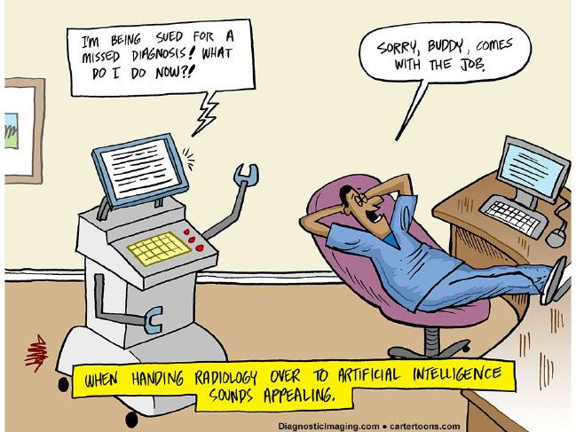
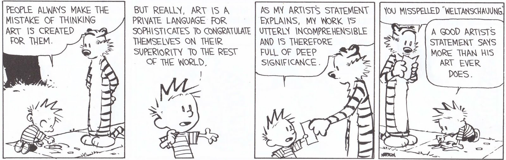
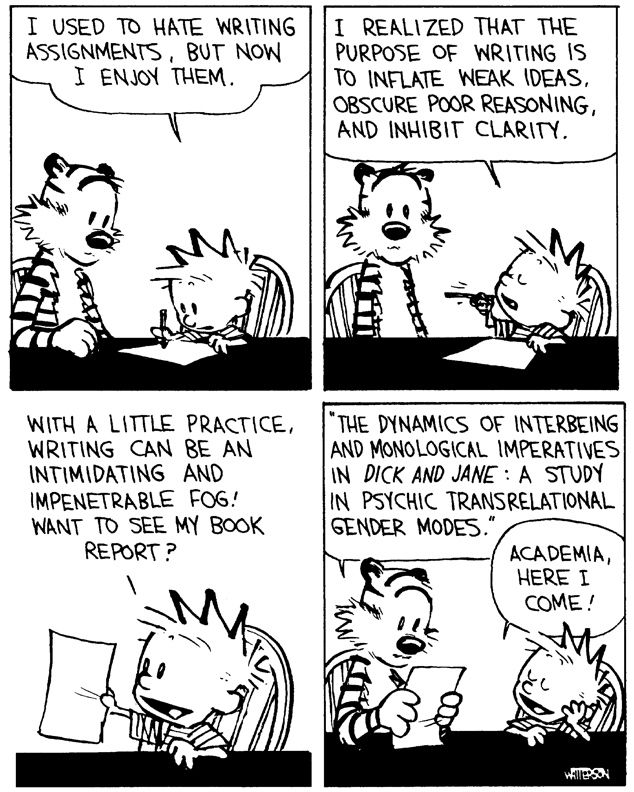

## About Me 
 * * *
 

 I did my Bachelor's in Technology from <b>Delhi Technological University</b> in 2016. After that I worked as Senior Engineer in Bajaj Automobile Ltd. for close to two years. Currently I am pursuing Ph.D  under <b> Dr. Phaneendra K. Yalavarthy</b> in field of Medical Imaging at <b>Department of Computational and Data Sciences</b> in <b>Indian Institute of Science, Bangalore</b>. Link to my <b>RESUME</b> is <a href= "pdf/Resume-AdityaRastogi-Aug2021.pdf" target="blank"><b>HERE</b></a>.   
The website of Medical Imaging Group of Indian Institute of Science can be found <a href = "http://cds.iisc.ac.in/faculty/yalavarthy/MIG/Links.html" target = "blank"> <b>HERE</b> </a>

I am the recipient of the prestigious <a href = "https://may2020.pmrf.in/" target = "blank"> <b> Prime Minister's Research Fellowship</b> </a> in August 2020
## Projects

* * *
 
### VTDCE-Net
####  A Time Invariant Deep Neural Network for Direct Estimation of Pharmacokinetic Parameters from Undersampled DCE MRI Data
##### Description

The objective of this work it to propose a robust time and space invariant deep learning algorithm to directly estimate pharmacokinetic/tracer kinetic (PK/TK) parameter from undersampled dynamic contrast-enhanced (DCE) MR images. DCE MRI consists of 4D (3D-spatial + temporal) data and is used to estimated 3D (spatial) tracer kinetic maps. Existing deep learning architectures for this task are either not invariant to temporal dimension or to both temporal and spatial dimensions. We proposed a deep learning algorithm that is invariant to training and testing in both temporal and spatial dimensions, i.e we can train the network on dataset consisting 'x' time samples and test in on dataset consisting 'y' time samples. Our experiments found that VTDCE-Net performs better than the Total Variation scheme on both breast and brain datasets for estimating capillary permeability and blood vessel volume fraction for all undersampling rates.

 

 *This work is in the under submission and the codes and results will be made publically available after the peer review process is completed*.

* * *

 
### SpiNet
#### Schatten p-norm Regularized Medical Image Reconstruction  [[Github Page](https://github.com/adityarastogi2k12/SpiNet){:target="_blank"}]
##### Description

The objective is to give a deep learning architecture for solving inverse problems which explicitely incorporates the forward model and uses noise statistics as prior. The noise prior is learnt using Deep Learning and the novelty of this architecture is that it can enforce any  norm where  and  can be kept fixed or estimated from the data (a trainable parameter). This work is published in<b> Medical Physics Journal </b>  <a href="#spinet">[2]</a>

* * *

### DCE MRI
#### Comparison of iterative parametric and indirect deep learning-based reconstruction methods in highly undersampled DCE MR Imaging of breast  [[Github Page](https://github.com/Medical-Imaging-Group/DCE-MRI-Compare){:target="_blank"}]
##### Description

The purpose of the project was to compare the performance of iterative direct and indirect parametric reconstruction methods with indirect deep learning based reconstruction methods in estimating tracer-kinetic parameters from highly undersampled DCE-MR Imaging breast data and provide a systematic comparison of the same. This work is published in <b> Medical Physics Journal </b>  <a href="#dce_mri">[1]</a>

* * *

### Image Denoising using CNN
#### E9 253:Neural Networks & Learning System Course Project  [[Github Page](https://github.com/ocimakamboj/DnCNN){:target="_blank"}] [[Results](Projects/NNLS/README.md)]
##### This project is done along with Ms. Ocima Kamboj [[Website](https://ocimakamboj.github.io/){:target="_blank"}]

This project was part of course <b>E9 253: Neural Networks and Learning Systems</b> the goal was to implement Deep Learning Denoiser using residual learning. We attempted to replicate the results of Zhang et.al. in their paper <a href = "https://ieeexplore.ieee.org/document/7839189" target="blank"> Beyond a Gaussian Denoiser: Residual Learning of Deep CNN for Image Denoising</a> and experimented with L2, L1 and SSIM loss functions and their combinations. We trained the network for gaussian denoising, deblurring, JPEG deblocking and image super resolution

## Assignments

* * *
### DS200:Research Methods 
#### Module 4  &nbsp;&nbsp;&nbsp;&nbsp;&nbsp;&nbsp;  [[Github Page](https://github.com/adityarastogi2k12/ds200){:target="_blank"}] [[Results](DS200/module4/README.md)]
##### Description

The objective is to use data visualization tools available in the python library <b>matplotlib</b>. The data used is the state-wise Police Complaint Registration Statistics of 2009 of all Indian States and U.Ts. It is available at <a href="https://www.data.gov.in" target="blank">https://www.data.gov.in</a> and was published by <a href="http://www.ncrb.gov.in" target="blank">http://www.ncrb.gov.in</a>, both part of Ministry of Home Affairs of Indian Government. The data gives the statistics of the method of complaint registration (oral/written/helpline/suomoto by police) and the category in which complaint is registered (IPC or SLL).I used <b>scatter plot</b>, <b>box plot</b> and <b>bar chart</b> to analyse the data and draw inference. The links to the <b>Result</b> and <b>Github repository</b> are given above.

## Teaching Duties

* * *
I have assisted in teaching of the following courses:

| Course      | Instructor | Institute   | Year   |
| ----------- | ----------- | ----------- | ----------- |
| DS 288: Numerical Methods      | Prof Phaneendra K Yalavarthy | Indian Institute of Science | Aug 2019 - Dec 2019|
|Biology for XI standard | Mrs Priyanka Sharma |Kendriya Vidyalaya, IISc | Jan 2021 - June 2021|
| DS 288: Numerical Methods      | Prof Phaneendra K Yalavarthy | Indian Institute of Science | Aug 2021 - Dec 2021|

## Publications

* * *

<b id="dce_mri">[1].</b> **Aditya Rastogi** and Phaneendra K. Yalavarthy, ``*Comparison of iterative parametric and indirect deep learning-based reconstruction methods in highly undersampled DCE‐MR Imaging of the breast*," Medical Physics 2020 (in press; 24 pages in journal format)
    [This work is the first comprehensive comparison of compressive sensing reconstruction methods with model based deep learning methods for the breast perfusion imaging and shows that deep learning methods are sub-optimal at higher undersampling rates.]

<b id="spinet">[2].</b> **Aditya Rastogi** and Phaneendra K. Yalavarthy, ``*SpiNet: A Deep Neural Network for Schatten p-normRegularized Medical Image Reconstruction," accepted with minor revisions in Medical Physics 2020
    [This work is first-of-its kind in proposing ageneric Schatten p-norm (0< p≤2) regularization based deep learning network for medical imagereconstruction, wherepis a trainable parameter (chosen automatically).]

## Miscellaneous

### Comics

Favourite comic strips

   

   

   

### Favourite quotes from TV Series

**Yes Minister, S1E1**  

Jim Hacker:    I'd like a new chair. I hate swivel chairs.  
Bernard Woolley:    It used to be said there were two kinds of chairs to go with two kinds of Minister: one sort folds up instantly; the other sort goes round and round in circles

**Yes Minister, S2E2**  

[Bernard explains to the Minister the honours available to senior Civil Servants.] 
Hacker:    Well, what has Sir Arnold to fear, anyway? He's got all the honours he could want, surely? 
Bernard:    Well, naturally he has his G. 
Hacker:    G? 
Bernard:    Yes; you get your G after your K. 
Hacker:    You speak in riddles, Bernard. 
Bernard:    Well, take the Foreign Office. First you get the CMG, then the KCMG, then the GCMG; the Commander of the Order of St Michael and St George, Knight Commander of St Michael and St George, Knight Grand Cross of St Michael and St George. Of course, in the Service, CMG stands for "Call Me God," and KCMG for "Kindly Call Me God."  
Hacker:     [chuckles] What does GCMG stand for?
Bernard:    "God Calls Me God."
<!-- Remove above link if you don't want to attibute -->

**Thin Blue Line, S2E2**  

Inspector Fowler:  Appearances, as we shall see, are like bus timetables: often highly misleading.

